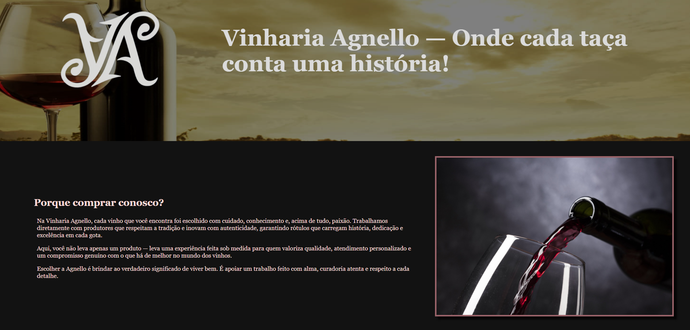
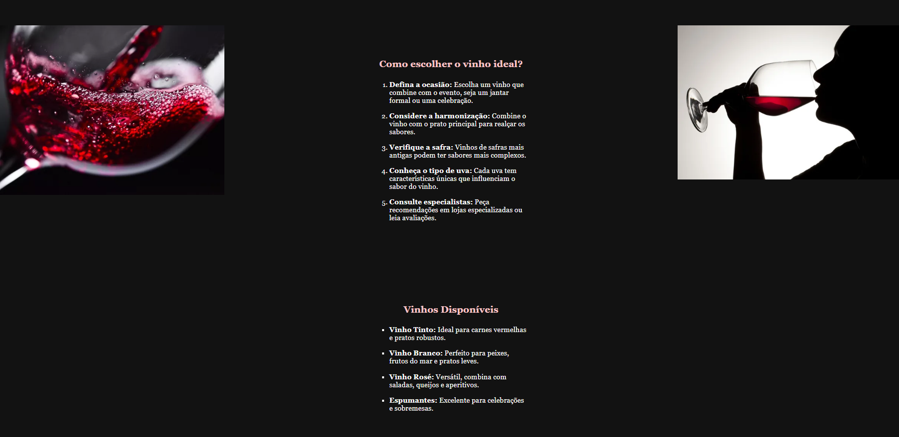
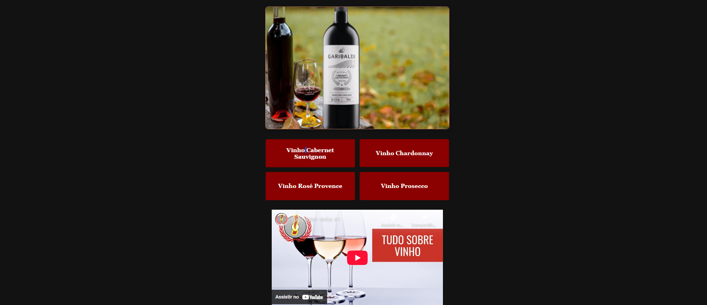
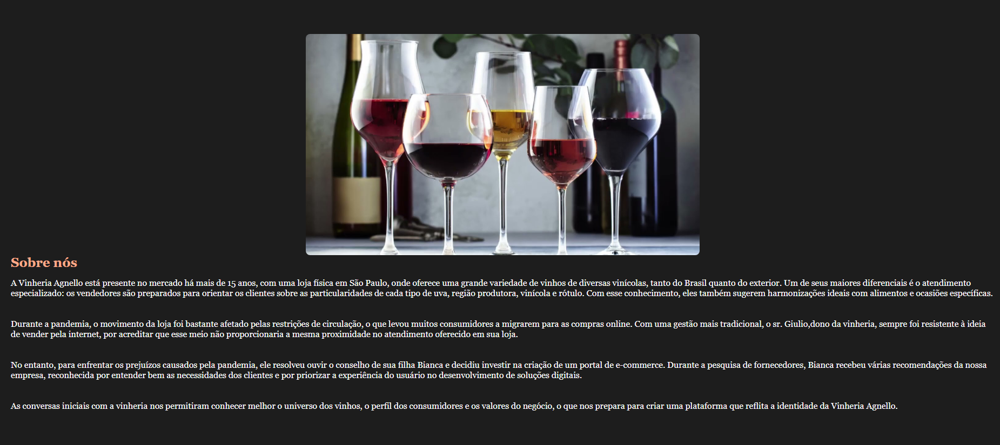
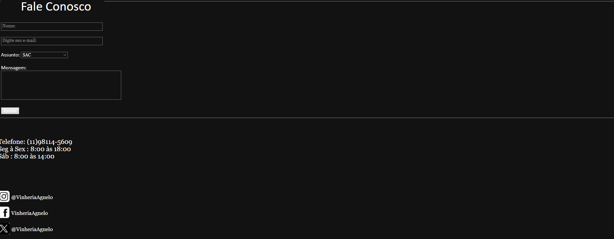

# Checkpoint_01_Front-End

## Descrição

O caso da Vinharia Agnello não é único, porém possui muitos aprendizados.
Tendo décadas no mercado, a Vinharia Agnello decidiu de vez entrar no e-commerce,
pedindo ajuda a FIAP e seus alunos para facilitarem a resolução de seus problemas.

## Tecnologias Utilizadas

- HTML5
- CSS3
- JavaScript
- Bootstrap
- Font Awesome
- Google Fonts

## Estruturação das Páginas

#### Github Pages - https://antoine-vitrian.github.io/Checkpoint_01_Front-End/

## Imagens do Projeto

### Página Inicial

### Catálogo de Vinhos

### Galeria de Vinhos

### Sobre a Vinharia

### Contato

